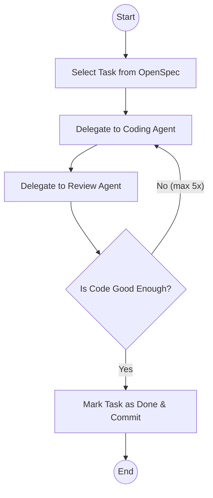

# Closing the Loop

I am continuously trying to improve the output of the AI tools I work with. AI agents can generate a lot of code quickly, but how do you make sure it's actually good?

To do this, I need to give it feedback. I can do this manually, but a better way is to automate this feedback loop. Automating the feedback loop allows the agent to run much longer without human intervention and greatly improves the quality of the generated code. This is closing the loop.

## The Basics

The most basic way to improve the quality of the generated code is to have the agent follow normal development best practices. This means compiling the code, running static code analyzers, and writing tests.

Compilation is the first test to see if the AI at least created code that compiles and can potentially work. Static code analyzers give more in-depth feedback on code quality. Maybe the most important part of software development is creating tests to prove that it actually works.

These are practices we should already have in place as developers. Why should it be different for AI agents? This will lead us to [level 5](/blog/the-ai-coding-ladder/#level-5-the-agentic-coder) on the AI coding ladder.

AI can write unit tests, but it can also do "manual" testing by controlling a browser. It can navigate to the web page, take screenshots, and compare them to expected results.

## Test, Testing, Testing

I'm pushing harder and harder for 100% test coverage. Apart from these tests, I want a [showboat](https://github.com/simonw/showboat) document that proves to me that the functionality works. For UI changes, it can use [rodney](https://github.com/simonw/rodney) to control the browser and take screenshots of the function in action. Thanks to [Simon Willison](https://simonwillison.net) for making such nice tools and giving some inspiration.

The bottom line is that I want my robot to prove to me that the functionality is working and of good quality.

## Reviewing

I don't fully trust my robot to write and test the functionality, even if it proves to me that everything is working. It may have missed some cases or introduced a bug it didn't catch.

Therefore I call in the help of another model. Lately, I'm gravitating towards writing code with GPT 5.4, so then I let Opus 4.6 review the code. Sometimes I'll throw in another instance of GPT 5.4 as well. The reviewer often comes back with very useful feedback about missed corner cases or missing functionality. It can also point out that the code is not following the coding standards in the codebase (although with the latest models, this happens far less).

This way we can close the loop completely and have the agent generate high-quality code with minimal human intervention.

I've created a command which instructs the agent to follow a workflow where it delegates work to specialized sub-agents.

This process keeps running and I can even put this in a [ralph-loop](/blog/ralph-wiggum-agentic-loops/) to implement the OpenSpec proposal.

## Lean In

If you notice that the robot is not delivering the correct end result, then instead of cursing it, lean in. Really try to give it the tools to catch this and continue working until the result is good. Can you define what "good" means to you?

## Go Slower to Go Faster

Is this slower than generating just the code? Yes, it's way slower. But the results are better on the first try. So, in the end, it will be faster. You'll notice that you're waiting longer for the end result, but when you get the result, it's more likely to be right immediately.
