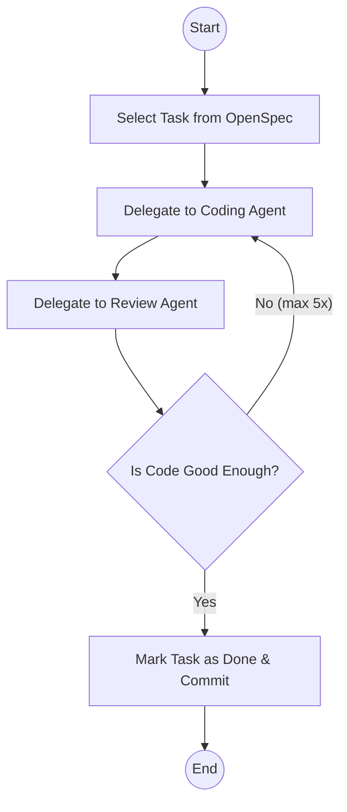

# Closing the Loop

AI agents can generate a lot of code quickly, but how do you make sure it's actually good? To do this, we need to give them feedback. We can do this manually, but a better way is to automate this feedback loop. Automating the feedback loop allows the agent to run much longer without human intervention and greatly improves the quality of the generated code. This is closing the loop.

# The basics

The most basic way to improve the quality of the generated code is to have the agent follow normal development best practices. This means compiling the code, running static code analyzers, and writing tests. Compiling the code becomes more standard nowadays as the tools embrace LSP (Language Server Protocol), which gives real-time feedback as the code is being written. Without LSP, the agent can still compile the code and use that feedback to at least deliver technically correct code. Static code analyzers are also easy to integrate and give more in-depth feedback on code quality. These are practices we should already have in place as developers. Tests are also an essential part of software development. Human developers should always have tests, so why should it be different for AI agents? This will lead us to [level 5](/blog/the-ai-coding-ladder/#level-5-the-agentic-coder) on the AI coding ladder.

AI can write unit tests, but it can also do "manual" testing by controlling a browser. It can navigate to the web page, take screenshots, and compare them to expected results.

# Reviewing

Lately I've been experimenting with the AI reviewing the generated code. After a generation loop where the agent has generated code, compiled it, run analyzers, and written tests, it's not done yet. I let another model review the code. I've had very good results using Opus 4.5 as the programming model and GPT-5.2 as the reviewer. The reviewer often comes back with very useful feedback about missed corner cases or missing functionality. It can also point out that the code is not following the coding standards in the codebase. This way we can close the loop completely and have the agent generate high-quality code with minimal human intervention.

I've created a command which instructs the agent to follow a workflow where it delegates work to specialized sub-agents.

This process keeps running and I can even put this in a loop to implement the OpenSpec proposal.

## Compilation and Analyzers

One of the biggest problems with AI-generated code is hallucination. The AI simply makes stuff up. It can invent functions that do not exist, or use APIs incorrectly. A compiler will catch these issues and is the first step in closing the loop. Your agent can compile the code and use the compiler feedback to fix the issues. The current trend is to use LSP (Language Server Protocol) in the agents, such that the agent can get real-time feedback from the compiler as it writes code, like a human developer would do using an IDE. This already improves the quality of the generated code significantly. Adding static code analyzers further improves the quality of the code.

You can give the reviewer the context you want. If you want it to focus on a limited number of tests, or on testing just one functionality per test case, you can instruct it to do so. The reviewer can also check if the code follows the coding standards of the project. It's not necessary to get this right the first time. Every time you see issues during your own review, you can add that to the prompt for the reviewer. Over time you will get better and better results.

# Go slower to go faster.

Is this slower than generating just the code? Yes — it's way slower. But the results are better on the first try. So, in the end, it will be faster. You'll notice that you're waiting longer for the end result, but when you get the result, it's more likely to be right immediately.
