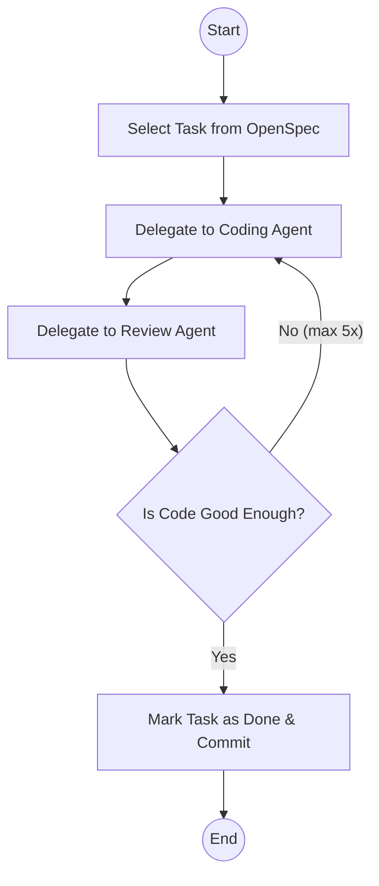

# Introducting The Reviewer

Lately, I've been experimenting by creating agent loops by introducing a reviewer to the mix. I was getting a little bit frustrated by having to review and point the agent in the right direction for obvious mistakes or omissions. This got me thinking whether AI could not do this for me. So, I introduced a reviewer. 

I already put a lot of effort into making sure that my agent follows a process to create the correct code and conforms to my coding standards. See my ["My AI Writes Code. Yours Can Too."](/blog/my-ai-workflow) for more information about this. This greatly improves the end result, but I still find myself reviewing the code and directing the AI to make some changes or fix some coding styles. For instance, sometimes the agent makes multiple tests which could have been tested in just one test, or it just in its puppy mind goes and forgets to apply some standards we have discussed earlier, so I have to direct and put it back on track again. This is something the reviewer can also do for me. 

## Review agent

With AI coding, you have to make sure to control your context because once your context is full, compaction might happen, and you will lose a lot of information. So the best way is to make sure that the context will be filled correctly and can be re-instantiated but also will not fill up easily. Sub-agents are great for that, because they get their own context, so you get them to set to work. They will create their own context, do their work, and report back only with the results, not polluting the context of the main agent. Another benefit of SubAgent is that you can specify which models should be used. This allows me to code with Opus but review with GPT-5.2. And I noticed that GPT 5.2 is really good at reviewing and comes back with a really great review. 

This is a small piece of the content for the review agent.
```md
When invoked:

1. Run `git diff` to see all changes
2. Read the **code-review** skill for methodology
3. Identify file types: code, configuration, infrastructure
4. Apply appropriate review strategies from the skill
5. Begin review with heightened scrutiny for configuration changes

## Important Questions

For every change, answer:

- Is the change as simple as possible?
- Are there any hidden side effects?
- Does the code comply with best practices and project standards?
- Does this contain breaking changes (API, database, configuration)?

## Output Format

Use the output format from the **code-review** skill:

- 🚨 CRITICAL - Must fix before deployment
- ⚠️ HIGH PRIORITY - Should fix
- 💡 SUGGESTIONS - Consider improving
```

You can change this to your heart's content. And you can put here anything you would like it to do and like to check. As you see, I also have a code review skill, where I have more details for different sets of changes. Because configuration changes I want to be checked differently than changes to my database. 

## The loop

In the beginning, I started by giving the task to the coding agent and after that asked the reviewing agent to review the changes and then give the results back to the coding agent to start fixing it, but this got old really fast. So I specified a workflow where when the coding agent is done, the reviewing agent is asked to review the work and then we will check the result of the reviewing agent. If the reviewing agent says it's a pass, then we can continue. But otherwise, we will pass the review commands back to the coding agent to fix it. And we will run this in a loop until we get to the level where the reviewing agent says that the code is good enough and then we commit it. 



This works really well, and the quality is way better. To even take it a step further, I usually ask to do this for all the tasks in OpenSpec in one go. So, it will keep on churning through the tasks until all tasks of the OpenSpec proposal are completed. 

# Go slower to go faster.

Is this slower than generating just the code? Yes — it's way slower. But the results are better on the first try. So, in the end, it will be faster. You'll notice that you're waiting longer for the end result, but when you get the result, it's more likely to be right immediately.
