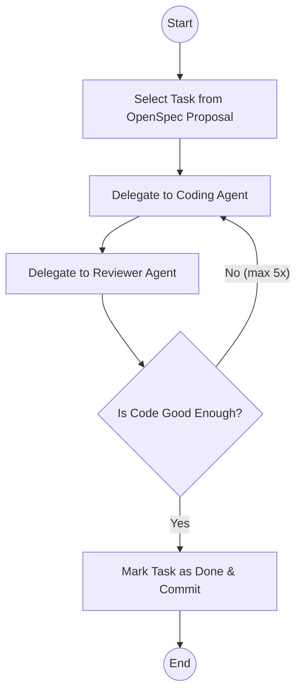

# The Reviewer

Lately, I've been experimenting with agent loops, and I added a reviewer to the mix. I was getting frustrated having to review and point the agent in the right direction for obvious mistakes or omissions. That got me wondering: could AI do the reviewing for me? So, I created a reviewer agent. 

I've already put effort into getting my coding agent to follow a process and stick to my standards. (I wrote more about that in ["My AI Writes Code. Yours Can Too."](/blog/my-ai-workflow)).

This greatly improves the end result. But I still find myself reviewing the code and nudging the AI to fix style issues. Sometimes the agent writes three tests where one would do. Or it gets excited about a solution and charges ahead, forgetting standards we discussed earlier. A bit of a puppy brain.

A reviewer agent can catch these issues before I have to. 

## The agent

With AI coding, you have to manage your context window. Once it's full, the system compacts it, and you lose information. So you want to keep it lean. Sub-agents are perfect for this. They run in their own context, do their thing, and just report back the results. No pollution of the main agent's context. Another perk of sub-agents: I can pick the model per role. This allows me to code with Claude Opus 4.5 but review with GPT 5.2. GPT 5.2 is very good at reviewing. The feedback is thorough and actionable. 

This is a small piece of the content for the reviewer agent.
```md
When invoked:

1. Run `git diff` to see all changes
2. Read the **code-review** skill for methodology
3. Identify file types: code, configuration, infrastructure
4. Apply appropriate review strategies from the skill
5. Begin review with heightened scrutiny for configuration changes

## Important Questions

For every change, answer:

- Is the change as simple as possible?
- Are there any hidden side effects?
- Does the code comply with best practices and project standards?
- Does this contain breaking changes (API, database, configuration)?

## Output Format

Use the output format from the **code-review** skill:

- 🚨 CRITICAL - Must fix before deployment
- ⚠️ HIGH PRIORITY - Should fix
- 💡 SUGGESTIONS - Consider improving
```

You can change this to your heart's content. Add whatever checks matter to you. I also have a code review skill with more detailed rules for different types of changes, because I want configuration changes checked differently than database changes or code changes.

For example, just yesterday the reviewer agent came back with:


This is exactly what I used to catch during my own reviews. Now I don't have to.

## The loop

At first, I did this manually: delegate to the coding agent, then ask the reviewer agent to check it, then pass the feedback back to the coding agent to fix. That got old fast. So I automated it into a loop. The coding agent does its work, and the reviewer agent checks it. If there are issues, they go back to the coding agent. This repeats until the reviewer agent gives a pass, then we commit. 



> [!NOTE]
> I cap it at five iterations. If it hasn't figured it out by then, something's fundamentally wrong and I need to step in.

This works really well, and the quality is way better. To even take it a step further, I usually ask to do this for all the tasks in OpenSpec in one go. So it keeps churning through the list until the entire OpenSpec proposal is complete. 

## Go slower to go faster

Is this slower than generating just the code? Yes, it's way slower. But the results are better on the first try. So, in the end, it will be faster. You'll notice that you're waiting longer for the end result, but when you get the result, it's more likely to be right immediately.
